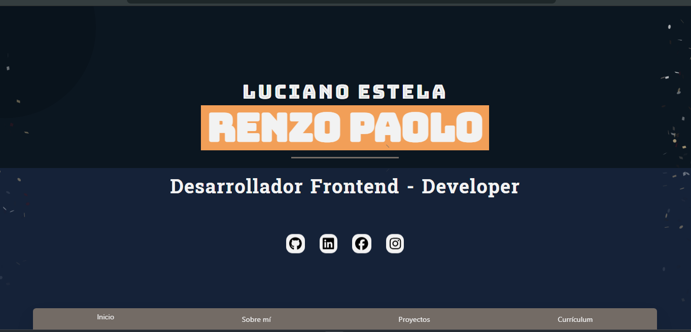

🖥️ Portafolio - Luciano Estela, Renzo Paolo

## 🛠️ Tecnologías Usadas

Este portafolio está construido con las siguientes tecnologías:

### Frontend
- **Vue.js** (Composition API)
- **Tailwind CSS** (para diseño rápido y responsivo)
- **FontAwesome Icons** (para iconografía moderna)

### Librerías
- **Canvas Confetti** 🎉 (para animaciones interactivas)

### Otras Herramientas
- **Git & GitHub** (control de versiones y repositorios)
- **Vite** (para desarrollo rápido y eficiente)
- **Google Fonts** (para tipografías personalizadas)

🖼️ Capturas de Pantalla

